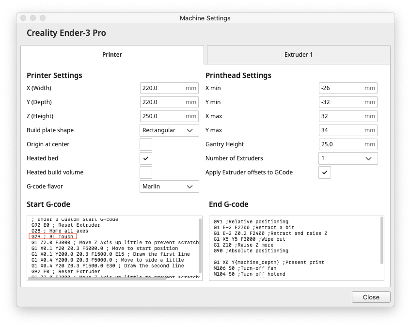

## Slicer Setting

1. Download [Cura](https://ultimaker.com/software/ultimaker-cura)

2. Add printer with `Creality - Ender 3 Pro` profile

3. Add `G29` to `Machine Settings` -> `Start G-code`

   

4. Adjust temperature. `210 C` for PLA+, `200 C` for PLA.

## Tuning

Parameters can be tunes using the following guide.

[Step by step to better print quality](https://teachingtechyt.github.io/calibration.html)

## Printer Information

Model Name: `Creality Ender-3 V2`

Firmware: [JyersUI](https://github.com/Jyers/Marlin) (__a third-party modified firmware is used on this machine__)

